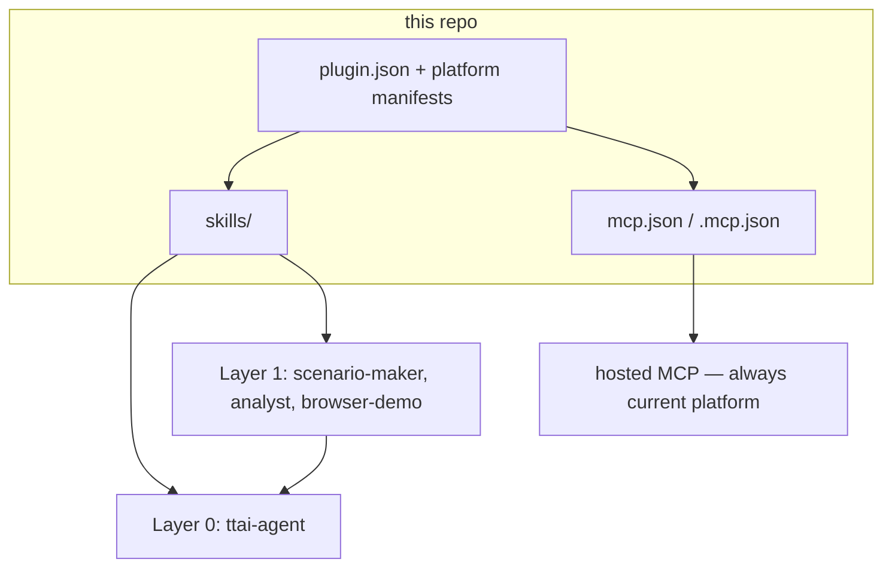

# Pin a version

Latest `main` is what most people should install — see the [README](README.md).
Use this page when you need a **specific** plugin, skill, or git revision in
your coding agent.

The hosted MCP server (`https://api.toughtongueai.com/api/public/mcp`) is
**not** versioned by this repo. Pinning skills or the plugin does not freeze
the live API.

## Contents

- How the pieces fit
- Git pin (most reliable)
- Plugin (Claude Code, Codex, Cursor, `npx plugins`)
- One skill (`npx skills`)
- MCP only
- What the `version` field means

## How the pieces fit



| You install     | You get                       | Versioned by                     |
| --------------- | ----------------------------- | -------------------------------- |
| **Plugin**      | Skills + MCP registration     | Git ref + plugin `version`       |
| **Skills only** | Workflow files, no live tools | Git ref of this repo             |
| **MCP only**    | 27 `ttai` tools               | The hosted server, not this repo |

## Git pin (most reliable)

Clone a branch, tag, or commit, then point the agent at that checkout.

```bash
git clone --depth 1 --branch v0.4.0 \
  https://github.com/tough-tongue/toughtongue-skills.git
# or: git clone https://github.com/tough-tongue/toughtongue-skills.git
#     git -C toughtongue-skills checkout <commit-sha>
```

Plugin `version` in the manifests (see `plugin.json`) is a **release
label**. Git refs are the actual pin. Prefer a **commit SHA** when you need
reproducibility — tags and branches can move.

## Plugin

### Claude Code

Marketplace add accepts `@ref` (branch or tag):

```bash
claude plugin marketplace add tough-tongue/toughtongue-skills@v0.4.0
claude plugin install toughtongue@toughtongue-skills
```

Same from inside a session: `/plugin marketplace add tough-tongue/toughtongue-skills@v0.4.0`
then `/plugin install toughtongue@toughtongue-skills`.

`/plugin install` itself has no `--version` flag. To freeze a **commit**,
clone at that SHA and load the directory:

```bash
claude --plugin-dir /path/to/toughtongue-skills
```

### Codex

Clone the ref, then register the checkout as a local marketplace:

```bash
codex plugin marketplace add /path/to/toughtongue-skills
codex plugin add toughtongue@toughtongue
```

### Cursor

Import-from-repo follows GitHub `main`. For a pin: clone the ref, then
**Settings > Plugins > Team Marketplaces > Add Marketplace** on the local
folder, or:

```bash
npx plugins add . -t cursor -s local -y
```

from that checkout.

### `npx plugins` (every detected agent)

```bash
npx plugins add tough-tongue/toughtongue-skills
```

That tracks GitHub HEAD. For a pin, run it from a cloned ref:

```bash
cd /path/to/toughtongue-skills
npx plugins add . -s local -y
```

## One skill

Interactive (picks skills and agents):

```bash
npx skills add tough-tongue/toughtongue-skills
```

One skill from a pinned checkout:

```bash
npx skills add /path/to/toughtongue-skills --skill scenario-maker
```

`--all` installs every skill in the repo, non-interactively. Refresh later
with `npx skills update` (that follows upstream — it will **not** keep a
SHA pin unless you keep installing from the local checkout).

To vendor a skill by hand: copy `skills/<name>/` (the `SKILL.md` plus
`references/`) into your agent's skills directory from the same git ref.

## MCP only

```json
{
  "mcpServers": {
    "ttai": {
      "url": "https://api.toughtongueai.com/api/public/mcp"
    }
  }
}
```

OAuth on first use. Headless: `Authorization: Bearer ${TTAI_PAT}` — never
paste the token into chat or config files. Per-client JSON: [MCP.md](MCP.md).

There is no "MCP v0.4" in this repository. Older plugin installs still point
at the same URL.

## What the `version` field means

`plugin.json`, `.claude-plugin/plugin.json`, `.codex-plugin/plugin.json`,
and `.cursor-plugin/plugin.json` share one `version` string. Claude Code
uses it as the cache key: **no bump → installed users do not update**.

Pinning git is how _you_ stay on an old copy. Bumping `version` is how
_everyone else_ receives a new one.
