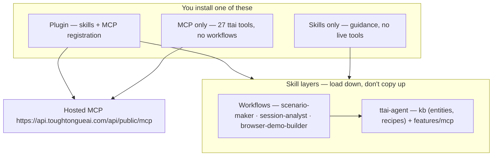

# Tough Tongue AI Skills

[](https://registry.modelcontextprotocol.io/v0.1/servers?search=com.toughtongueai/mcp)

Agent skills and MCP server for [Tough Tongue AI](https://app.toughtongueai.com),
the platform for handling tough conversations. Some, the AI takes: voice
agents that answer and place calls, qualify leads, run demos, screen
candidates, and book meetings. Others, you nail: hyper-realistic roleplay
that gets you ready for negotiations, interviews, and coaching conversations.

Install once, then work with Tough Tongue AI from Claude Code, Codex, Cursor, or
any agent that supports the Agent Skills format:

- _"Pull the last 3 lost deals from our call notes and create a practice
  scenario for the pricing objection."_
- _"For the Enterprise Discovery Call scenario, pull the last 50 sessions.
  What are the top 5 improvement areas?"_
- _"The onboarding agent keeps ending calls too early. Pull the low-scoring
  sessions, find out why, and fix the scenario."_

These compose with the rest of your MCP ecosystem: Gong, Notion, calendar,
slides, email. See [What you can do](#what-you-can-do) for the full journeys.

## Table of contents

- [Tough Tongue AI Skills](#tough-tongue-ai-skills)
  - [Table of contents](#table-of-contents)
  - [What's included](#whats-included)
  - [How this repo is structured](#how-this-repo-is-structured)
  - [Prerequisites](#prerequisites)
  - [Which setup fits you?](#which-setup-fits-you)
  - [Set up](#set-up)
    - [All supported agents (user scope)](#all-supported-agents-user-scope)
    - [Claude Code](#claude-code)
    - [Codex](#codex)
    - [Cursor](#cursor)
    - [Copilot / Windsurf / Gemini CLI / other agents](#copilot--windsurf--gemini-cli--other-agents)
    - [Skills only](#skills-only)
    - [MCP only](#mcp-only)
  - [Verify your setup](#verify-your-setup)
  - [What you can do](#what-you-can-do)
    - [1. Practice this sales call](#1-practice-this-sales-call)
    - [2. How is my team doing?](#2-how-is-my-team-doing)
    - [3. Refine from real conversations](#3-refine-from-real-conversations)
    - [4. Prep me for this meeting](#4-prep-me-for-this-meeting)
    - [5. Automated post-call coaching](#5-automated-post-call-coaching)
  - [MCP Server](#mcp-server)
  - [Troubleshooting](#troubleshooting)
  - [Repository structure](#repository-structure)
  - [Related](#related)
  - [License](#license)

## What's included

This repo ships two layers that work together, plus plugins that bundle both:

**Skills** — workflow guidance your agent loads automatically when the
conversation matches:

| Skill                                               | When it activates                                                  | What it does                                                                             |
| --------------------------------------------------- | ------------------------------------------------------------------ | ---------------------------------------------------------------------------------------- |
| [ttai-agent](skills/ttai-agent)                     | Any Tough Tongue AI / ttai question                                | Intelligence layer: scope, capability, entities, scenario quality, runtime, MCP guidance |
| [scenario-maker](skills/scenario-maker)             | "Create a scenario", "create a voice agent", "fix the scenario", … | Create, edit, or refine scenarios via MCP.                                               |
| [session-analyst](skills/session-analyst)           | "How is my team doing?", "top improvement areas", …                | Turn session data into structured reports.                                               |
| [browser-demo-builder](skills/browser-demo-builder) | "Record browser demo steps", …                                     | Pre-recorded browser demo steps via MCP.                                                 |

**MCP server** — live actions in your Tough Tongue AI account. 27 tools over the
public API: scenarios, sessions, analytics, organizations, SIP, meeting bots,
and collections. Full catalog in [MCP.md](MCP.md).

**Plugins** (Claude Code, Codex, Cursor) — bundle the skills **and** the MCP
server registration in one install.

How the layers relate:

- **ttai-agent** is the provider-neutral intelligence layer: it turns intent
  into scoped, capability-aware decisions using the entity handbook and
  features/mcp adapter guidance.
- **Workflow skills** add judgment for a job (create, refine, analyze, record a demo).
- With skills only, your agent can advise. With MCP only, it can call tools.
  With both, it picks the right workflow and completes it. The plugin gives
  you both in one step.

Need a specific git tag, commit, or a single skill? See [INSTALL.md](INSTALL.md).

## How this repo is structured



Workflow skills tell the agent **when**. They load **ttai-agent** for **what
exists** and **how to act**. Situation recipes (cold call, sales roleplay,
coaching, demo, cascade TTS) live under
`skills/ttai-agent/kb/scenario-recipes/` — not copied into every workflow skill.

The intelligence layer has no terminal or UI dependency. Coding agents load it
before calling MCP; web conversational plugins can pass verified account,
workspace, and focused-resource context to the same layer, then execute the
result through their server-side adapter.

## Prerequisites

Every path needs a **Tough Tongue AI account** — sign up at
[app.toughtongueai.com](https://app.toughtongueai.com).

That's it for interactive setups. Authentication is **OAuth-first**: the
first time your agent calls a Tough Tongue AI tool, the client opens a
browser consent page — approve once and the client stores the token
(Claude Code and Codex use your system keychain). No environment variables,
no app restarts.

> **Upgrading from a PAT-based install?** After updating the plugin you'll
> see a one-time OAuth prompt (Claude Code: run `/mcp` and authenticate;
> Codex: `codex mcp login ttai` or approve the automatic prompt). Your
> existing PAT keeps working for manual/headless configs.

<details>
<summary>Headless / CI / automation: use a PAT instead</summary>

Browser OAuth can't run in headless environments. Create a **Personal Access
Token (PAT)** at
[app.toughtongueai.com/developer](https://app.toughtongueai.com/developer)
and export it where your agent runs:

```bash
export TTAI_PAT="<your-token>"
```

Then register the server manually with a bearer header — per-client commands
in [MCP only](#mcp-only) and [MCP.md](MCP.md).

> **Note**: never commit the PAT or paste it into config files — reference it
> only through the `TTAI_PAT` environment variable.

</details>

## Which setup fits you?

| Setup                    | Best for                                      | What you get                                       |
| ------------------------ | --------------------------------------------- | -------------------------------------------------- |
| **Plugin** (recommended) | Claude Code, Codex, Cursor                    | Skills + MCP, auto-configured in one install       |
| **Skills + MCP, manual** | Copilot, Windsurf, Gemini CLI, other agents   | Same capability, assembled in two steps            |
| **Skills only**          | Any Agent Skills client, no live tools needed | Workflow guidance; the agent advises but can't act |
| **MCP only**             | Developers who want raw API tools             | 27 tools; no workflow guidance                     |

Not sure? Use the plugin — it's the least setup. Per-client instructions
below. To freeze a git tag, commit, or a single skill, see
[INSTALL.md](INSTALL.md).

## Set up

### All supported agents (user scope)

The [`plugins` CLI](https://www.npmjs.com/package/plugins) detects supported
coding agents on your machine — Claude Code, Cursor, Codex, Grok Build, Kimi
Code, GitHub Copilot CLI, and VS Code — then installs the skills and MCP
server into their **user configuration**:

```bash
npx plugins add tough-tongue/toughtongue-skills
```

> **Scope warning:** this command defaults to user scope. Do not use its
> automatic all-agent mode for an isolated repository test. GitHub Copilot
> CLI and VS Code install plugins per user, and Codex has no plugin scope
> option, so `--scope local` cannot make that automatic path fully local.
> Use the client-specific test paths below instead.

Restart your agent, then say "get me started with Tough Tongue AI". The
`ttai-agent` intelligence layer verifies the connection and routes you to the
right workflow. On the first tool call your client opens the browser OAuth
consent — approve once and you're connected.

This repo is also a standard [Agent Plugin](https://agent-plugins.org)
(root `plugin.json`, `skills/`, `mcp.json`), so clients that load Agent
Plugins natively can point straight at it. Prefer your client's own plugin
system? Per-client instructions below.

### Claude Code

The plugin bundles the skills and registers the Tough Tongue AI MCP server
(`.mcp.json`) in one install: no separate `claude mcp add` step needed.
On the first tool call, Claude Code opens a browser OAuth consent — approve
once and you're connected (re-authenticate anytime with `/mcp`).

Inside Claude Code:

```text
/plugin marketplace add tough-tongue/toughtongue-skills
/plugin install toughtongue@toughtongue-skills
```

Or from the terminal:

```bash
claude plugin marketplace add tough-tongue/toughtongue-skills --scope user
claude plugin install toughtongue@toughtongue-skills --scope user
```

Then say "get me started with Tough Tongue AI" or call
`ttai:list_organizations`. `ttai-agent` verifies the connection, takes a
lightweight inventory, and selects the relevant workflow.

Skills are namespaced after install: invoke them as
`/toughtongue:scenario-maker`,
`/toughtongue:session-analyst`, or `/toughtongue:browser-demo-builder`;
or just describe the task and Claude picks the right skill automatically.

<details>
<summary>Upgrade, scoped install, or local development</summary>

**Upgrade** — refresh the marketplace catalog, then move the installed pin
to the latest version:

```bash
claude plugin marketplace update toughtongue-skills
claude plugin update toughtongue@toughtongue-skills
```

Then run `/reload-plugins` in your session to apply.

**Persistent install for one checkout** — use Claude Code's `local` scope:

```bash
claude plugin marketplace add tough-tongue/toughtongue-skills --scope local
claude plugin install toughtongue@toughtongue-skills --scope local
```

`user` is the default scope and enables the plugin across your projects.
`local` enables it only for the current checkout on this machine. Claude Code
uses a shared cache under `~/.claude/plugins/cache` at either scope; the cache
does not enable the plugin in other projects.

Remove the local test when finished:

```bash
claude plugin uninstall toughtongue@toughtongue-skills --scope local
claude plugin marketplace remove toughtongue-skills --scope local
```

**One-off local development** — load the checkout without installing or
registering a marketplace:

```bash
claude --plugin-dir /path/to/toughtongue-skills
# after edits, run /reload-plugins inside the session
```

</details>

### Codex

The plugin bundles the skills and registers the Tough Tongue AI MCP server
(`.mcp.json`) in one install. Codex plugin commands use `CODEX_HOME` (by
default `~/.codex`) and do **not** offer a project or local scope:

```bash
codex plugin marketplace add tough-tongue/toughtongue-skills
codex plugin add toughtongue@toughtongue
```

Then restart Codex and start a new thread. Codex detects the server's OAuth
support and prompts you to log in (or run `codex mcp login ttai`). Say "get
me started with Tough Tongue AI" to verify the setup and start your first
workflow.

<details>
<summary>Upgrade, isolated testing, or removal</summary>

**Upgrade** — both steps are needed; the first refreshes the marketplace
snapshot, the second re-pins the installed plugin to it:

```bash
codex plugin marketplace upgrade toughtongue
codex plugin add toughtongue@toughtongue
```

**Isolated local test** — direct Codex at a disposable configuration directory
before registering the checkout:

```bash
export CODEX_HOME="$(mktemp -d)"
codex plugin marketplace add /path/to/toughtongue-skills
codex plugin add toughtongue@toughtongue
```

Discard that temporary directory when finished. Without `CODEX_HOME`, the same
commands change your normal user configuration.

**Remove a normal install**:

```bash
codex plugin remove toughtongue@toughtongue
codex plugin marketplace remove toughtongue
```

</details>

### Cursor

In Cursor, go to **Settings > Plugins > Team Marketplaces > Add Marketplace >
Import from Repo**, point it at
`https://github.com/tough-tongue/toughtongue-skills`, then install
**toughtongue**.

Or assemble it manually in two steps:

1. Install the skills:

   ```bash
   npx skills add tough-tongue/toughtongue-skills
   ```

2. Add the MCP server:
   [**Install in Cursor**](cursor://anysphere.cursor-deeplink/mcp/install?name=ttai&config=eyJ1cmwiOiJodHRwczovL2FwaS50b3VnaHRvbmd1ZWFpLmNvbS9hcGkvcHVibGljL21jcCJ9)
   — one click adds the server; Cursor prompts for OAuth consent on first
   use. Or add it manually via "Cursor Settings" > "MCP" (config JSON in
   [MCP.md](MCP.md#cursor)).

<details>
<summary>Upgrade</summary>

Re-import the marketplace from **Settings > Plugins > Team Marketplaces**.
If you installed the skills via the CLI, refresh them with
`npx skills update`.

</details>

### Copilot / Windsurf / Gemini CLI / other agents

For a user-wide setup, the `plugins` CLI above supports GitHub Copilot CLI and
VS Code when detected. Those clients do not support a project-local plugin
scope. For Windsurf, Gemini CLI, or another agent, install the skills and MCP
server as two steps:

**1. Install the skills.** Works with any Agent Skills-compatible client:

```bash
npx skills add tough-tongue/toughtongue-skills
```

The CLI prompts you to pick which skills to install and which agents to
configure. To install everything non-interactively:

```bash
npx skills add tough-tongue/toughtongue-skills --all
```

Update existing skills later with:

```bash
npx skills update
```

**2. Add the MCP server.** Point your client at the hosted server — the
general shape is:

```json
{
  "mcpServers": {
    "ttai": {
      "url": "https://api.toughtongueai.com/api/public/mcp"
    }
  }
}
```

Clients with OAuth support prompt for consent on first use. For clients (or
headless setups) that need a bearer token instead, add
`"headers": { "Authorization": "Bearer ${TTAI_PAT}" }` with the PAT from
[Prerequisites](#prerequisites). Exact config per client (Copilot/VS Code,
Windsurf, Gemini CLI) is in [MCP.md](MCP.md#connect-your-client).

**Stdio-only clients** (Claude Desktop, Zed, older VS Code): bridge to the
hosted server with [mcp-remote](https://github.com/geelen/mcp-remote) — see
[MCP.md](MCP.md#clients-without-remote-mcp-support).

### Skills only

Want the workflow guidance without connecting your account?

```bash
npx skills add tough-tongue/toughtongue-skills
```

The agent can advise on scenario design, evaluation rubrics, and coaching
patterns — but it can't create or modify anything in Tough Tongue AI. Add the
MCP server later (step 2 above) when you want action.

### MCP only

If you only want the tools (no skills) — OAuth flow starts on first use:

```bash
# Codex
codex mcp add ttai --url https://api.toughtongueai.com/api/public/mcp
codex mcp login ttai

# Claude Code
claude mcp add --transport http ttai https://api.toughtongueai.com/api/public/mcp
# then run /mcp in a session to authenticate
```

Headless / CI (PAT bearer auth instead of OAuth):

```bash
# Codex
codex mcp add ttai --url https://api.toughtongueai.com/api/public/mcp \
  --bearer-token-env-var TTAI_PAT

# Claude Code
claude mcp add --transport http ttai https://api.toughtongueai.com/api/public/mcp \
  --header "Authorization: Bearer ${TTAI_PAT}"
```

More clients in [MCP.md](MCP.md).

## Verify your setup

Ask your agent:

```text
Call the ttai MCP tool list_organizations and show me the result.
Then list my scenarios.
```

You should see two things:

- The agent reaches your Tough Tongue AI account and returns real data — the
  MCP connection works.
- The agent reasons in Tough Tongue AI terms — scenarios, sessions, rubrics,
  report cards — the skills are loaded.

On a **skills-only** setup, verify with "What can I do with Tough Tongue AI?" —
the agent should describe the workflows but won't be able to call tools.

## What you can do

Coding agents are where work happens now. These journeys show Tough Tongue AI
composing with the other tools already connected to your agent: copy any
prompt to start.

### 1. Practice this sales call

A sales manager spots an AE struggling with pricing objections in real calls.

> Pull the last 3 calls from Gong where we lost on pricing. Create a
> Tough Tongue AI scenario to practice handling that objection, using our
> positioning doc from Notion. Give me the shareable practice link.

Gong MCP (`search_calls` / `list_calls` → `get_call_transcript`) + Notion MCP
→ **scenario-maker** builds a sales roleplay from the real objections →
`create_scenario` → shareable practice link.

### 2. How is my team doing?

A VP of Sales wants the team's skill gaps, not raw transcripts.

> For the "Enterprise Discovery Call" scenario, pull the last 50 sessions.
> What are the top 5 improvement areas? Build me a 3-slide deck.

**session-analyst** → `list_sessions` (scores, strengths, weaknesses per
session) → aggregates report-card topics and weakness themes → slides MCP for
the deck.

### 3. Refine from real conversations

A CS manager notices low scores on the onboarding scenario.

> Pull the 5 lowest-scoring sessions for our onboarding scenario, figure out
> what went wrong, and fix the scenario.

`list_sessions` (sorted by score) → `get_sessions_batch` (full transcripts +
evaluations) → **scenario-maker** diagnoses the root cause → surgical
`update_scenario`: live for the next session.

### 4. Prep me for this meeting

A sales rep has a discovery call in 30 minutes.

> I have a call with Sarah Chen from Acme Corp in 30 minutes. Create a quick
> practice scenario so I can rehearse.

Calendar MCP + web search for attendee/company context → **scenario-maker**
→ `create_scenario` → start practicing in minutes.

### 5. Automated post-call coaching

An engineering team wires coaching into their call pipeline.

> Every time a call ends in Gong, analyze the transcript and email the rep a
> coaching report.

Webhook script → `create_session` (ingest transcript against a coaching
scenario) + `post_process_session` → poll `get_sessions_batch` until analysis
completes → email MCP sends the report. Full recipe in
[session-analyst's report templates](skills/session-analyst/references/report-templates.md).

## MCP Server

The plugin registers Tough Tongue AI's hosted MCP server at
`https://api.toughtongueai.com/api/public/mcp` (Streamable HTTP, OAuth 2.1
with dynamic client registration; PAT bearer auth for headless setups).
There is nothing to install and no local process to run. It exposes 27 tools
over the public API: scenarios (create, update, generate, access tokens),
sessions (list with evaluations, single and batch fetch, ingest,
post-process), analytics and organizations, SIP phone calls, meeting bots,
and collections.

**See [MCP.md](MCP.md)** for the full tool catalog, per-client setup
(Claude Code, Codex, Cursor, Copilot, Windsurf, Gemini CLI), and
troubleshooting.

The same OAuth flow powers the web connectors. In claude.ai, add a custom
connector (Settings > Connectors) pointing at the server URL with the Client
ID and Secret left empty. In ChatGPT (Business/Enterprise/Edu), enable
developer mode and create a custom MCP app with OAuth. Full steps for both
are in [MCP.md](MCP.md#claudeai-web).

## Troubleshooting

- **Fewer than 27 ttai tools listed**: your agent trimmed or cached tool
  discovery. Start a fresh thread; if it persists, remove and re-add the MCP
  server.
- **401 / authentication errors**: the OAuth login hasn't completed for this
  client. Claude Code: run `/mcp` and authenticate in the browser. Codex:
  `codex mcp login ttai`. Cursor: Cursor Settings > MCP > log in on the ttai
  server. If you're on a manual PAT config instead, check `TTAI_PAT` is
  visible to the agent process (re-export, `launchctl setenv` on macOS,
  fully restart the app).
- **Skills installed but the agent can't do anything**: skills are guidance
  only — the agent also needs the MCP server for live actions. See
  [Which setup fits you?](#which-setup-fits-you) and add the MCP server for
  your client.
- **Using claude.ai or ChatGPT web?**: same OAuth flow, via custom
  connectors. See the [web connector sections](MCP.md#claudeai-web) in
  MCP.md.
- **Scenario edits not taking effect in a running call**: scenario changes
  apply to new sessions only; sessions compile their prompt at start.

<details>
<summary>Reinstalling the plugin (Claude Code)</summary>

If `/plugin install` fails or `claude plugin list` shows stale entries, do a
clean reinstall — run these in order in any Claude Code session:

1. `/plugin marketplace remove toughtongue-skills`
2. `/plugin marketplace add tough-tongue/toughtongue-skills`
3. `/plugin marketplace update toughtongue-skills`
4. `/plugin install toughtongue@toughtongue-skills`

Step 3 forces Claude Code to re-read the marketplace manifest. After step 4,
`claude plugin list` should show one `toughtongue@toughtongue-skills` entry.

</details>

## Repository structure

On-disk layout. How to pin a plugin, skill, or git ref: [INSTALL.md](INSTALL.md).

```
toughtongue-skills/
├── plugin.json            # Agent Plugins 1.0.0 manifest (agent-plugins.org)
├── mcp.json               # Agent Plugins MCP config (streamable-http; no credentials)
├── .plugin/               # Marketplace entry for the `npx plugins` CLI
├── .claude-plugin/        # Claude Code plugin + marketplace manifests
├── .codex-plugin/         # Codex plugin manifest
├── .cursor-plugin/        # Cursor plugin manifest
├── .agents/plugins/       # Codex plugin-marketplace entry
├── .mcp.json              # Claude-native MCP server registration (OAuth; no credentials)
├── MCP.md                 # MCP server docs: setup per client, tool catalog
├── skill-evals/           # Evaluation scenarios per skill
└── skills/                # Each: SKILL.md (+ kb/ / features/ or references/) + agents/openai.yaml
    ├── ttai-agent/            # Grand map: kb (entities, recipes) + features/mcp
    ├── scenario-maker/        # Create / edit / refine (loads ttai-agent)
    ├── session-analyst/       # Report templates
    └── browser-demo-builder/  # Deterministic browser demo steps: format, selectors, example
```

## Related

- [Sign up](https://app.toughtongueai.com) ·
  [Developer portal / PAT](https://app.toughtongueai.com/developer) ·
  [Platform docs](https://app.toughtongueai.com/docs) ·
  [llms-full.txt](https://app.toughtongueai.com/llms-full.txt) (AI-readable
  API reference)
- [Privacy policy](https://app.toughtongueai.com/privacy-policy/) ·
  [Terms of service](https://app.toughtongueai.com/terms/) — the canonical
  legal URLs for Tough Tongue AI, required when submitting the MCP server to
  the Claude Connectors Directory or a plugin marketplace. Note the paths:
  `/privacy-policy/` and `/terms/`, not `/privacy` or `/tos`.
- [voice-ai-quickstart](https://github.com/tough-tongue/voice-ai-quickstart):
  starter templates for building apps on Tough Tongue AI (Next.js, Flask,
  co-navigation demo, scenario-as-code CLI) and the `toughtongue-ai`
  integration skill for developers embedding the platform.

## License

MIT
