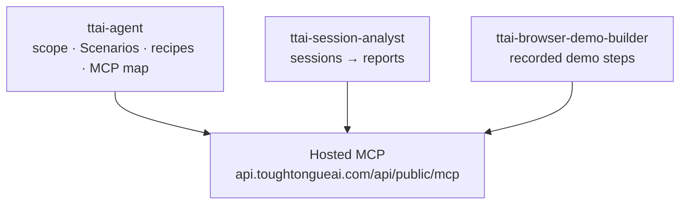

# Tough Tongue AI Skills

[](https://registry.modelcontextprotocol.io/v0.1/servers?search=com.toughtongueai/mcp)

Skills, plugins, and a hosted MCP server for
[Tough Tongue AI](https://app.toughtongueai.com) — the platform for tough
conversations. Some the AI takes: voice agents that call, demo, screen, and
book. Others you nail: realistic roleplay for negotiations, interviews, and
coaching. Install once; your agent builds, runs, and improves both from a
personal or organization workspace.

Try asking:

- _"Pull the last 3 lost deals from our call notes and create a practice
  scenario for the pricing objection."_
- _"For the Enterprise Discovery Call scenario, pull the last 50 sessions.
  What are the top 5 improvement areas?"_
- _"The onboarding agent keeps ending calls too early. Find out why and fix
  the scenario."_

## Install

One command configures every supported agent you have (Claude Code, Cursor,
Codex, Copilot CLI, VS Code, Grok Build, Kimi Code) at **user scope**:

```bash
npx plugins add tough-tongue/toughtongue-skills
```

Restart the agent and say "get me started with Tough Tongue AI". The first
tool call opens a browser OAuth consent; approve once. No env vars, no PAT.

<details>
<summary>Claude Code</summary>

```text
/plugin marketplace add tough-tongue/toughtongue-skills
/plugin install toughtongue@toughtongue-skills
```

Or `claude plugin marketplace add tough-tongue/toughtongue-skills --scope user`
then `claude plugin install toughtongue@toughtongue-skills --scope user`.
Re-authenticate anytime with `/mcp`. Skills are namespaced:
`/toughtongue:ttai-agent`, `/toughtongue:ttai-session-analyst`,
`/toughtongue:ttai-browser-demo-builder`.

**Upgrade**

```bash
claude plugin marketplace update toughtongue-skills
claude plugin update toughtongue@toughtongue-skills   # then /reload-plugins
```

**One checkout only** — `local` scope enables the plugin for the current
checkout on this machine (`user` is the default):

```bash
claude plugin marketplace add tough-tongue/toughtongue-skills --scope local
claude plugin install toughtongue@toughtongue-skills --scope local
# remove: claude plugin uninstall toughtongue@toughtongue-skills --scope local
#         claude plugin marketplace remove toughtongue-skills --scope local
```

**Develop on this repo** — `claude --plugin-dir /path/to/toughtongue-skills`
(then `/reload-plugins` after edits).

</details>

<details>
<summary>Codex</summary>

Codex plugin commands use `CODEX_HOME` (default `~/.codex`) and have no
project scope.

```bash
codex plugin marketplace add tough-tongue/toughtongue-skills
codex plugin add toughtongue@toughtongue
```

Restart, start a new thread, and log in when prompted (or
`codex mcp login ttai`).

**Upgrade** (both steps)

```bash
codex plugin marketplace upgrade toughtongue
codex plugin add toughtongue@toughtongue
```

**Isolated test** — use a disposable config, then discard it:

```bash
export CODEX_HOME="$(mktemp -d)"
codex plugin marketplace add /path/to/toughtongue-skills
codex plugin add toughtongue@toughtongue
```

**Remove**: `codex plugin remove toughtongue@toughtongue` then
`codex plugin marketplace remove toughtongue`.

</details>

<details>
<summary>Cursor</summary>

**Settings > Plugins > Team Marketplaces > Add Marketplace > Import from
Repo** → `https://github.com/tough-tongue/toughtongue-skills`, then install
**toughtongue**. Upgrade by re-importing.

Manual: `npx skills add tough-tongue/toughtongue-skills`, then
[**Install the MCP server in Cursor**](cursor://anysphere.cursor-deeplink/mcp/install?name=ttai&config=eyJ1cmwiOiJodHRwczovL2FwaS50b3VnaHRvbmd1ZWFpLmNvbS9hcGkvcHVibGljL21jcCJ9).

</details>

<details>
<summary>Copilot, Windsurf, Gemini CLI, Claude Desktop, claude.ai, ChatGPT, other</summary>

`npx plugins` covers Copilot CLI and VS Code (per-user only; neither has a
project-local plugin scope). For the rest, install skills and MCP separately:

```bash
npx skills add tough-tongue/toughtongue-skills        # add --all for everything
```

Then register `https://api.toughtongueai.com/api/public/mcp` (Streamable
HTTP, OAuth). Exact config for Windsurf, Gemini CLI, Claude Desktop
(mcp-remote), claude.ai, and ChatGPT:
[clients.md](skills/ttai-agent/references/mcp/clients.md).

</details>

<details>
<summary>Headless / CI: PAT instead of OAuth</summary>

Create a Personal Access Token at
[app.toughtongueai.com/developer](https://app.toughtongueai.com/developer),
`export TTAI_PAT="<token>"`, and register the server with a bearer header
that references the variable by name — see
[clients.md](skills/ttai-agent/references/mcp/clients.md). Never paste the token
into config files or chat.

</details>

<details>
<summary>Skills only, or MCP only</summary>

- **Skills only** (`npx skills add …`): the agent advises on Scenario design
  and reports but cannot act.
- **MCP only**: raw tools, no workflows. Claude Code:
  `claude mcp add --transport http ttai https://api.toughtongueai.com/api/public/mcp`.
  Codex: `codex mcp add ttai --url …` then `codex mcp login ttai`.

</details>

<details>
<summary>Pin a version or install one skill</summary>

Git refs are the real pin; prefer a commit SHA. The hosted MCP server is not
versioned by this repo, so pinning never freezes the live API.

- **Claude Code** — `claude plugin marketplace add tough-tongue/toughtongue-skills@<tag>`,
  then `claude plugin install toughtongue@toughtongue-skills`. For a commit,
  clone at that SHA and run `claude --plugin-dir <checkout>`.
- **Codex** — clone the ref, `codex plugin marketplace add <checkout>`, then
  `codex plugin add toughtongue@toughtongue`.
- **Cursor** — clone the ref and add the local folder under Settings >
  Plugins > Team Marketplaces.
- **`npx plugins`** — `npx plugins add <checkout>` from a clone (user scope,
  every detected agent).
- **One skill** — `npx skills add <checkout> --skill ttai-agent`, or copy
  `skills/<name>/` with its `references/`.

The plugin `version` is shared by every manifest. Claude Code caches on it:
without a bump, installed users do not update.

</details>

**Verify** — ask: _"Call ttai:callme_before_using_tough_tongue_mcp, then
ttai:list_organizations, and list my scenarios."_ Real data means MCP works;
answers in Scenario/session/rubric terms mean the skills loaded.

## How the skills fit together

One main skill plus two specialists. Each is self-contained, so installing a
single skill never leaves dead links.


```mermaid
flowchart TB
  TA["ttai-agent<br/>scope · Scenarios · recipes · MCP map"]
  SA["ttai-session-analyst<br/>sessions → reports"]
  BD["ttai-browser-demo-builder<br/>recorded demo steps"]
  TA --> MCP["Hosted MCP<br/>api.toughtongueai.com/api/public/mcp"]
  SA --> MCP
  BD --> MCP
```

| Skill                                                          | Say…                                                             | Does                                                                                   |
| -------------------------------------------------------------- | ---------------------------------------------------------------- | -------------------------------------------------------------------------------------- |
| [ttai-agent](skills/ttai-agent)                                | "create a voice agent", "fix the scenario", "list my orgs"       | Scope, entities, Scenario create/edit/repair, situation recipes, MCP tool map          |
| [ttai-session-analyst](skills/ttai-session-analyst)            | "how is my team doing?", "top improvement areas for scenario X" | Reads sessions, scores, and transcripts; builds reports; ingests external transcripts |
| [ttai-browser-demo-builder](skills/ttai-browser-demo-builder) | "record browser demo steps", "the demo clicks the wrong thing"   | Turns a recording or walkthrough into deterministic browser steps on a Scenario      |

Every skill reads files on demand from its own `references/`, each linked
directly from its `SKILL.md`. With skills only the agent advises; with MCP only
it calls tools; with both it picks the workflow and completes it. The plugin
installs both.

<details>
<summary>Plugin packaging</summary>

This repo is also a standard [Agent Plugin](https://agent-plugins.org) (root
`plugin.json`, `skills/`, `mcp.json`), plus Claude, Codex, Cursor, and
`npx plugins` manifests. All share one `version`.

</details>

## What you can do

<details>
<summary>1. Practice this sales call</summary>

> Pull the last 3 calls from Gong where we lost on pricing. Create a Tough
> Tongue AI scenario to practice that objection, using our positioning doc
> from Notion. Give me the shareable practice link.

Gong + Notion MCP → **ttai-agent** → `create_scenario` → practice link.

</details>

<details>
<summary>2. How is my team doing?</summary>

> For "Enterprise Discovery Call", pull the last 50 sessions. Top 5
> improvement areas? Build me a 3-slide deck.

**ttai-session-analyst** → `v3_list_sessions` (evaluation requested) → aggregate
report-card topics → slides MCP.

</details>

<details>
<summary>3. Refine from real conversations</summary>

> Pull the 5 lowest-scoring onboarding sessions, find out what went wrong,
> and fix the scenario.

**ttai-session-analyst** → `v3_list_sessions` (with evaluation) → sort by
`final_score` → transcripts for the lowest 5 → **ttai-agent** diagnoses →
surgical `update_scenario`, live for the next session.

</details>

<details>
<summary>4. Prep me for this meeting</summary>

> I have a call with Sarah Chen from Acme in 30 minutes. Create a quick
> practice scenario.

Calendar MCP + web search → **ttai-agent** → `create_scenario`.

</details>

<details>
<summary>5. Automated post-call coaching</summary>

> Every time a call ends in Gong, analyze the transcript and email the rep a
> coaching report.

Webhook → `create_session` (ingest; analysis queues automatically) → poll
`get_session` until the evaluation exists. Recipe:
[ingest and reprocess](skills/ttai-session-analyst/references/ingest-and-reprocess.md).

</details>

## Troubleshooting

<details>
<summary>An expected ttai tool is missing</summary>

The agent cached tool discovery. Start a fresh thread; if it persists, remove
and re-add the MCP server.

</details>

<details>
<summary>401 / authentication errors</summary>

OAuth is not finished for this client. Claude Code: `/mcp`. Codex:
`codex mcp login ttai`. Cursor: Settings > MCP > log in. On a PAT config,
make `TTAI_PAT` visible to the agent process (re-export, `launchctl setenv`
on macOS, restart the app).

</details>

<details>
<summary>Skills installed but the agent can't act</summary>

Skills are guidance; live actions need the MCP server. Add it for your
client ([clients.md](skills/ttai-agent/references/mcp/clients.md)).

</details>

<details>
<summary>Scenario edits don't affect a running call</summary>

Sessions compile their prompt at start. Edits apply to new sessions.

</details>

<details>
<summary>Reinstall the plugin (Claude Code)</summary>

1. `/plugin marketplace remove toughtongue-skills`
2. `/plugin marketplace add tough-tongue/toughtongue-skills`
3. `/plugin marketplace update toughtongue-skills`
4. `/plugin install toughtongue@toughtongue-skills`

`claude plugin list` should then show one `toughtongue@toughtongue-skills`.

</details>

## Repository structure

```text
toughtongue-skills/
├── plugin.json, mcp.json    # Agent Plugins manifest + MCP config (no credentials)
├── .claude-plugin/ .codex-plugin/ .cursor-plugin/ .plugin/ .agents/plugins/
├── .mcp.json                # Claude-native MCP registration (OAuth)
├── skill-evals/             # 3 evaluation scenarios per skill
└── skills/
    ├── ttai-agent/                # main: SKILL.md + references/{scenario,recipes,entities,mcp}
    ├── ttai-session-analyst/      # sessions → reports
    └── ttai-browser-demo-builder/ # recorded browser demo steps
```

## Related

- [Sign up](https://app.toughtongueai.com) ·
  [Developer portal / PAT](https://app.toughtongueai.com/developer) ·
  [Platform docs](https://app.toughtongueai.com/docs) ·
  [llms-full.txt](https://app.toughtongueai.com/llms-full.txt)
- [Privacy policy](https://app.toughtongueai.com/privacy-policy/) ·
  [Terms of service](https://app.toughtongueai.com/terms/)
- [voice-ai-quickstart](https://github.com/tough-tongue/voice-ai-quickstart):
  starter templates for building apps on Tough Tongue AI.

## License

MIT
