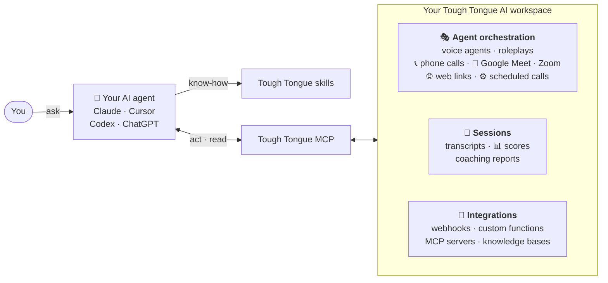

# Tough Tongue AI Skills

[](https://registry.modelcontextprotocol.io/v0.1/servers?search=com.toughtongueai/mcp)

[Tough Tongue AI](https://app.toughtongueai.com) is the platform for tough
conversations. Some the AI takes: voice agents that call, demo, screen, and
book. Others you nail: realistic roleplay for negotiations, interviews, and
coaching. This plugin lets your coding agent build, run, and improve both, in
your personal or organization workspace.

## How it works


```mermaid
%%{init: {"flowchart": {"wrappingWidth": 400}}}%%
flowchart LR
  agent["🤖 Your AI agent<br/>Claude · Cursor<br/>Codex · ChatGPT"]
  you(["You"]) -->|ask| agent
  agent -->|know-how| skills["Tough Tongue skills"]
  agent <-->|act · read| mcp["Tough Tongue MCP"]
  mcp <--> ws
  subgraph ws["Your Tough Tongue AI workspace"]
    direction LR
    orch["`🎭 **Agent orchestration**
    voice agents · roleplays
    📞 phone calls · 🎥 Google Meet · Zoom
    🌐 web links · ⚙️ scheduled calls`"]
    sess["`💬 **Sessions**
    transcripts · 📊 scores
    coaching reports`"]
    integ["`🔔 **Integrations**
    webhooks · custom functions
    MCP servers · knowledge bases`"]
  end
```

Armed with these skills, your coding agent becomes a workspace commander for
your Tough Tongue AI voice agents.

## Get started

### 1. Install

#### Coding agents

These get the skills and the MCP server together.

**Any coding agent** (Claude Code, Cursor, Codex, Copilot CLI, VS Code)

```bash
npx plugins add tough-tongue/toughtongue-skills
```

**Claude Code**

```text
/plugin marketplace add tough-tongue/toughtongue-skills
/plugin install toughtongue@toughtongue-skills
```

**Codex**

```bash
codex plugin marketplace add tough-tongue/toughtongue-skills
codex plugin add toughtongue@toughtongue
```

**Cursor**

Settings > Plugins > Team Marketplaces > Add Marketplace > Import from Repo,
enter `https://github.com/tough-tongue/toughtongue-skills`, then install
**toughtongue**.

**Windsurf, Gemini CLI, and other coding agents**

```bash
npx skills add tough-tongue/toughtongue-skills
```

Then add a remote (HTTP) MCP server with the URL
`https://api.toughtongueai.com/api/public/mcp`. Config snippets:
[clients.md](skills/ttai-agent/references/mcp/clients.md).

#### Web agents

These connect to the MCP server directly.

**claude.ai and Claude Desktop**

Settings > Connectors > Add custom connector. Name it `Tough Tongue AI`, paste
`https://api.toughtongueai.com/api/public/mcp`, and approve the sign-in.

**ChatGPT**

Settings > Apps, find **Tough Tongue AI** in the app directory, and connect.

### 2. Sign in

Restart your agent. The first Tough Tongue AI action opens a browser sign-in;
approve it once. No API key needed. (No browser, e.g. CI? Use an API key, a
personal access token from the developer portal: see
[clients.md](skills/ttai-agent/references/mcp/clients.md).)

### 3. Ask

> Get me started with Tough Tongue AI.

Then try:

- _"Create a practice scenario for an enterprise pricing negotiation."_
- _"For the Enterprise Discovery Call scenario, pull the last 50 sessions. What
  are the top 5 improvement areas?"_
- _"The onboarding agent keeps ending calls too early. Find out why and refine
  it."_

## Skills

- [ttai-agent](skills/ttai-agent): create, edit, and refine Scenarios;
  workspaces, calls, meeting bots, and sharing.
- [ttai-session-analyst](skills/ttai-session-analyst): turn session scores and
  transcripts into team and coaching reports.
- [ttai-browser-demo-builder](skills/ttai-browser-demo-builder): script browser
  steps for product demos from a recording or a walkthrough.
- [ttai-agent-apps](skills/ttai-agent-apps): build Agent Desktop apps, such as a
  board or checklist the voice agent updates during a call.

Your agent picks the right skill on its own. In Claude Code you can also call
one directly, for example `/toughtongue:ttai-agent`.

## What you can do

- **Practice a lost deal.** _"Pull the last 3 calls from Gong where we lost on
  pricing and create a scenario to practice that objection."_
- **See how the team is doing.** _"Top 5 improvement areas from the last 50
  Enterprise Discovery Call sessions, as a 3-slide deck."_
- **Improve an agent from real calls.** _"Find what went wrong in the 5
  lowest-scoring onboarding sessions and refine the scenario."_
- **Prep for a meeting.** _"I meet Sarah Chen from Acme in 30 minutes. Create a
  quick practice scenario."_
- **Score real calls automatically.** _"Every time a call ends in Gong, score
  the transcript and email the rep a coaching report."_

## Update

**Claude Code**

```bash
claude plugin marketplace update toughtongue-skills
claude plugin update toughtongue@toughtongue-skills
```

**Codex**

```bash
codex plugin marketplace upgrade toughtongue
codex plugin add toughtongue@toughtongue
```

`npx plugins add` and Cursor's import always install the latest version.

## Troubleshooting

- **Sign-in or 401 errors**: finish the browser sign-in. Claude Code: `/mcp`.
  Codex: `codex mcp login ttai`. Cursor: Settings > MCP.
- **A Tough Tongue AI tool is missing**: start a new chat; if it persists,
  remove and re-add the MCP server.
- **The agent explains but can't act**: the skills are installed but the MCP
  server is not. Add it for your client
  ([clients.md](skills/ttai-agent/references/mcp/clients.md)).
- **A Scenario change doesn't show in a running call**: edits apply to new
  sessions.

## Links

[Platform docs](https://app.toughtongueai.com/docs) ·
[Privacy policy](https://app.toughtongueai.com/privacy-policy/) ·
[Terms of service](https://app.toughtongueai.com/terms/)

## License

MIT
